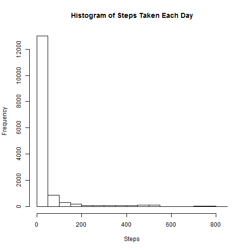
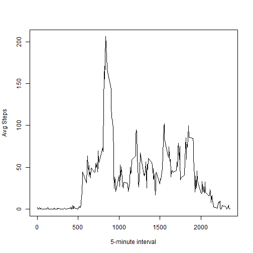
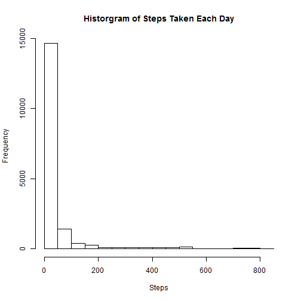
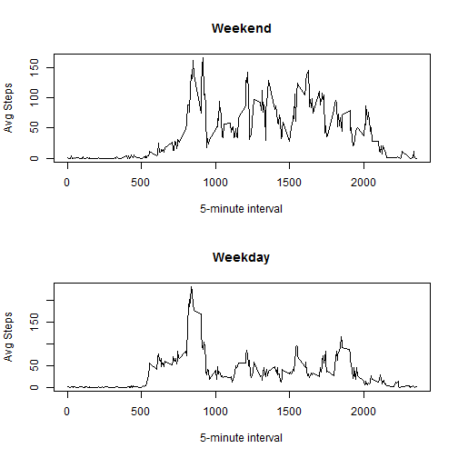

## Loading and preprocessing the data


```r
data<-read.csv("C:/Users/azink/Desktop/Classes/Repro_Research/RepData_PeerAssessment1/data/activity.csv", colClasses=c("integer","Date","integer"))

library(plyr)
```

## What is the average daily activity pattern?


```r
hist(data$steps, xlab="Steps", main="Historgram of Steps Taken Each Day")
```

 

```r
mean<-mean(data$steps,na.rm=TRUE)
median<-median(data$steps,na.rm=TRUE)

avg_steps<-tapply(data$steps, data$interval, mean, na.rm=TRUE)
intervals<-unique(data$interval)

plot(intervals,avg_steps,type="l",xlab="5-minute interval",ylab="Avg Steps")
```

 

```r
max<-which(avg_steps==max(avg_steps))
maxint<-names(max)
```
The mean and median of steps taken each day is 37.3825996 and 0, respectively. The max number of steps, averaged across days, occurs in 5-minute interval 835.

## Imputing missing values

```r
nmissing<-sum(is.na(data))
missIndex<-is.na(data$steps)
avg_steps_all<-rep(avg_steps, 61)
avg_steps_sub<-avg_steps_all[missIndex]
steps2<-replace(data$steps, is.na(data$steps),avg_steps_sub)
data2<-cbind(data, steps2)

hist(data2$steps2, xlab="Steps", main="Historgram of Steps Taken Each Day")
```

 

```r
mean2<-mean(data2$steps2,na.rm=TRUE)
median2<-median(data2$steps2,na.rm=TRUE)
```
There are 2304 rows of missing data. Any day missing a 5-minute interval value of steps, will use the mean of that 5 minute interval accross all days. 
The mean and median of steps taken each day, when missing values are imputed, is 37.3825996 and 0, respectively. 

## Are there differences in activity patterns between weekdays and weekends?

```r
data2$wkfact<-factor(weekdays(data2$date) %in% c("Saturday","Sunday"))
levels(data2$wkfact)[levels(data2$wkfact)=="TRUE"] <- "weekend"
levels(data2$wkfact)[levels(data2$wkfact)=="FALSE"] <- "weekday"

avg_steps2<-ddply(data2,c("interval","wkfact"), summarize, mean.steps=mean(steps2))
par(mfrow = c(2, 1))

wknd<-avg_steps2[avg_steps2$wkfact == "weekend", ]
wkday<-avg_steps2[avg_steps2$wkfact == "weekday", ]

plot(intervals,wknd$mean.steps,type="l",xlab="5-minute interval",ylab="Avg Steps",main="Weekend")
plot(intervals,wkday$mean.steps,type="l",xlab="5-minute interval",ylab="Avg Steps",main="Weekday")
```

 
